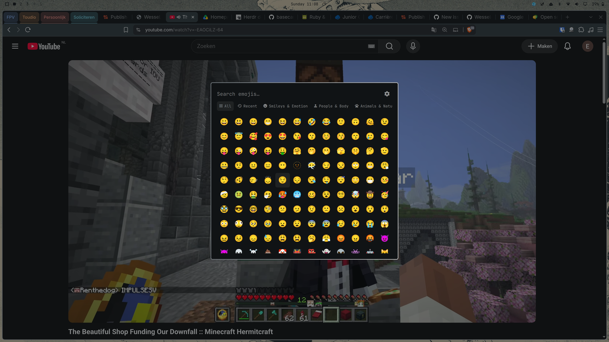

# Better Emojis for Omarchy

A drop-in replacement for the built-in Omarchy emoji picker (`Super + Ctrl + E`)
with category tabs, recents, skin tones, gender variants, and adjustable sizing,
designed for keyboard-first use in the Omarchy shell.



## Install

```bash
omarchy plugin add https://github.com/Wessel-Boers/omarchy-better-emojis.git --enable
```

That's it. The plugin registers itself as the implementation behind
`omarchy.emojis`, so your existing `Super + Ctrl + E` binding opens it and the
stock picker is disabled automatically. Removing the plugin restores the stock
picker:

```bash
omarchy plugin remove wessel.better-emojis
```

## Features

- **Category tabs** — All, Recent, Smileys & Emotion, People & Body,
  Animals & Nature, Food & Drink, Activities, Travel & Places, Objects,
  Symbols, Flags. Searching always searches every category with multi-word AND
  matching.
- **Recents** — the last 30 inserted emojis are remembered and available from
  the Recent tab.
- **Skin tones** — choose a default tone in Settings or show all five exact
  Unicode tone variants beside each base emoji. The grid never shows duplicate
  standalone tone variants.
- **Gender variants** — person, woman, and man variants are combined by default.
  Enable all gender variants in Settings when you want them shown separately.
- **Settings page** — the gear switches the overlay from the emoji grid to a
  dedicated Settings page. The emoji icon returns to the grid.
- **Preset sizing** — emoji size (Normal / Large / Extra Large), window width
  (Normal / Wide / Extra Wide), and window height (Normal / Tall / Extra Tall).
  Grid columns distribute evenly across the complete overlay width at every size.
- **Keyboard navigation** — Settings uses group-level navigation: Tab and
  Shift+Tab move between groups, Up and Down move between groups, and Left and
  Right select options within the active group.
- **Copy mode** — `Ctrl + Enter` copies instead of typing into the focused app.
- **Theme aware** — uses Omarchy menu tokens, `Button`, `Toggle`, and
  `PanelSeparator` components. Toggle shapes follow system corner roundedness.
- **Nerd Font navigation icons** — category tabs and view navigation use the
  same Nerd Font icon style as the Omarchy bar.
- **1,914 emojis** — generated from Unicode emoji-test.txt with CLDR names and
  keywords (Emoji 17-era data), ordered exactly like every other platform.

## Keyboard shortcuts

| Key | Action |
| --- | --- |
| type | Search all categories |
| `Esc` | Clear search in emoji view; dismiss the overlay from Settings |
| arrows / PgUp / PgDn | Move the emoji cursor |
| `Tab` / `Shift + Tab` | Next / previous category tab |
| `Ctrl + 1` … `Ctrl + 9` | Jump to tab N |
| `Ctrl + T` | Cycle skin tone |
| `Ctrl + G` | Cycle displayed gender when genders are combined |
| `Enter` | Insert selected emoji |
| `Ctrl + Enter` | Copy selected emoji |
| `Ctrl + S` | Open Settings / return to emojis |
| `Ctrl + ,` | Open Settings / return to emojis (alias) |

When Settings is open:

| Key | Action |
| --- | --- |
| `Tab` / `Shift + Tab` | Move to the next / previous settings group |
| `Up` / `Down` | Move between settings groups |
| `Left` / `Right` | Choose an option in the active group |
| `Enter` / `Space` | Activate the selected option, toggle, or action |

## Settings

Settings persist in
`~/.local/state/omarchy/plugins/wessel.better-emojis/settings.json`
(deliberately outside the plugin folder so `omarchy plugin update` stays a clean
fast-forward): emoji size, window width/height, chosen skin tone, recent
emojis, skin-tone display, gender display mode and visibility. The picker
always opens on All.

Settings include:

- Emoji size: Normal, Large, Extra Large
- Window width: Normal, Wide, Extra Wide
- Window height: Normal, Tall, Extra Tall
- Default skin tone and the all-tones grid toggle
- All-genders grid toggle, off by default so genders are combined
- Show Recent tab and Clear recent emojis

## How it works

The manifest carries `"omarchy": { "clonedFrom": "omarchy.emojis" }`. The shell
routes every call made to the built-in `omarchy.emojis` id — including the
`Super + Ctrl + E` binding — to the enabled plugin that claims it, and disables
the stock picker while this one is enabled. It's the same mechanism
`omarchy plugin clone` uses, shipped as a standalone plugin.

## Development

Regenerate the emoji dataset (requires network):

```bash
python3 tools/generate_emoji_data.py
```

Validate the manifest the same way the shell does:

```bash
omarchy plugin validate .
```

For local testing, symlink or copy the repo into
`~/.config/omarchy/plugins/wessel.better-emojis/`, run
`omarchy plugin enable wessel.better-emojis`, then hit `Super + Ctrl + E`.
Edits under `~/.config/omarchy/plugins/` hot-reload.

## License

MIT
